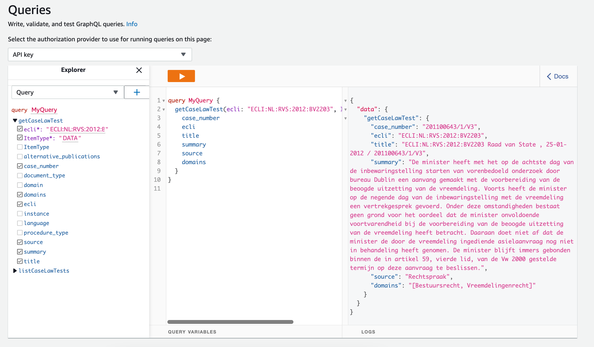
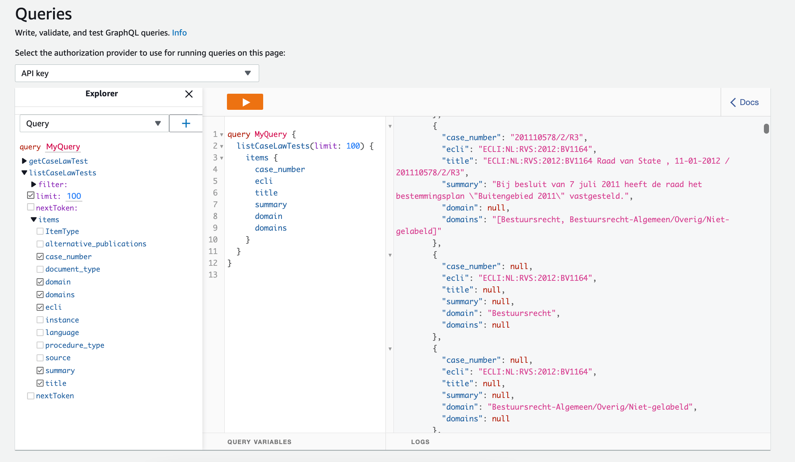

# GraphQL API 

This walkthrough will teach you how to setup your AWS account to run, load, and serve the from the defined sources (see [Datasets](/datasets/)). You will setup a GraphQL endpoint for your data using AWS AppSync. 

## Setup

Make sure your AWS account and local environment is ready. 

### AWS services

In order run the pipeline and publish the GraphQL endpoint, you need to setup a few AWS services in your account. As it follows:

- **IAM account**: generate AWS credentials that you will be using them later in your `.env` file to access all the AWS thorough code. More in the [Understanding and getting your AWS credentials](https://docs.aws.amazon.com/general/latest/gr/aws-sec-cred-types.html#access-keys-and-secret-access-keys) guide.
    - In the navigation bar on the upper right, click on [My Security Credentials](https://console.aws.amazon.com/iam/home#security_credential).
    - Click on the **Access keys (access key ID and secret access key)** section.
    - Click on the **Create New Access Key** button. 
    - Save the `Access Key ID` and `Secret Access Key` somewhere safe, since you cannot see them again unless you re-generate them.
- **AWS Region**: choose a proper location that you will be using later in your `.env` file to configure the AWS services. More in the [Choose an AWS Region](https://docs.aws.amazon.com/emr/latest/ManagementGuide/emr-plan-region.html) guide.
    - Choose a region from list to the right of your account information on the navigation bar. 
    - ⚠️ Be careful when using `us-east-1` region, since it does not require [constraint configuration](concepts-availability-zones), and it will yield errors when running the code.
- **DynamoDB**: create a DynamoDB table to store the extracted data. You will use the table name later in your `.env` file. Read more in the [Getting Started with DynamoDB](https://docs.aws.amazon.com/amazondynamodb/latest/developerguide/getting-started-step-1.html) guide.
    - Open the [DynamoDB console](https://console.aws.amazon.com/dynamodbv2/).
    - On the right side of the console, click on [Create table](https://console.aws.amazon.com/dynamodbv2/home#create-table).
    - Enter the details on the table:
        - Name of the table.
        - Partition key: `ecli`.
        - Sort key: `ItemType`.
        - Settings as `Default settings`.
    - Finally, click on **Create table**.
- **AWS AppSync**: create a GraphQL endpoint to serve the data stored in the DynamoDB. Read more in the [Import from Amazon DynamoDB](https://docs.aws.amazon.com/appsync/latest/devguide/import-dynamodb.html) guide.
    - Open the [AppSync Console](https://console.aws.amazon.com/appsync/).
    - Click on [Create API](https://console.aws.amazon.com/appsync/home#/create).
    - In the **Customize your API or import from Amazon DynamoDB** panel select `Import DynamoDB Table`. 
    - Click on **Start**.
    - Create a model with the details:
        - The AWS Region selected before.
        - The DynamoDB table created before.
    - Click on **Import**, and finally on **Create**.
- **S3**: create a persistent storage for your data. An S3 bucket will be automatically created with the scripts once you name it in the `.env` file. Or create it manually following the [Creating a bucket](https://docs.aws.amazon.com/AmazonS3/latest/userguide/create-bucket-overview.html) guide. 
- **Amazon OpenSearch Service**: create an indexing service that facilitates the search of content inside your data. An OpenSearch domain will be automatically created with the scripts once you name it in the `.env` file. Or initiate it manually following the [Create an OpenSearch Service domain](https://docs.aws.amazon.com/opensearch-service/latest/developerguide/gsgcreate-domain.html) guide.

### Local setup

Clone the [maastrichtlawtech/case-law-explorer](https://github.com/maastrichtlawtech/case-law-explorer) project.

```bash
$ git clone https://github.com/maastrichtlawtech/case-law-explorer
```

Install the required Python packages.

```bash
$ pip install -r requirements.txt
```

Create the environmental variables into the `.env` file, as suggested in [`.env.example` file](https://raw.githubusercontent.com/maastrichtlawtech/case-law-explorer/master/.env.example).  

```.env.example
URL_RS_ARCHIVE=http://static.rechtspraak.nl/PI/OpenDataUitspraken.zip

LI_ENDPOINT=https://api.legalintelligence.com
LI_CLIENT_ID=client@id.here
LI_CLIENT_SECRET=secret-string-here

LIDO_ENDPOINT=http://linkeddata.overheid.nl/service/get-links
LIDO_USERNAME=lido-username-here
LIDO_PASSWORD=lido-pw-here

AWS_ACCESS_KEY_ID=acceskeyid
AWS_SECRET_ACCESS_KEY=secretaccesskey
AWS_REGION=aws-region-here
AWS_DEFAULT_REGION=aws-region-here

DDB_TABLE_NAME=dynamodb-table-name
S3_BUCKET_NAME=s3-bucket-name
OS_DOMAIN_NAME=elasticsearch-domain-name
OS_INDEX_NAME=elasticsearch-index-name

APPSYNC_ENDPOINT=appsync-endpoint-here
COGNITO_USER_KEY=my-user-key-here
COGNITO_CLIENT_ID=client-secret-here
```

The [`.env.example` file](https://raw.githubusercontent.com/maastrichtlawtech/case-law-explorer/master/.env.example) contains the following variables:

- `URL_RS_ARCHIVE`, `LI_`, and `LIDO_` variables are used in the extraction of the data. They are also described in the [Caselaw extraction](/etl/?id=setup) walkthrough. 
- `AWS_ACCESS_KEY_ID` and `AWS_SECRET_ACCESS_KEY` are the credentials keys generated before, in the IAM console. 
- `AWS_REGION` is the default region set before in the AWS console. 
- `DDB_TABLE_NAME` is the name of the DynamoDB table generate before.
- `S3_BUCKET_NAME` is the name of the S3 bucket that will be generated on your behalf. If you have a S3 bucket already, be sure you set it here.
- `OS_DOMAIN_NAME` and `OS_INDEX_NAME` are the names of the OpenSearch domain that will be generated for you. If you already have an existent domain, be sure you set it here.
- `APPSYNC_ENDPOINT` and `COGNITO_` variables are used in the developer API demos available in the published [notebooks](https://github.com/maastrichtlawtech/case-law-explorer/tree/master/notebooks/api).

## Loading

If you don't have the processed data stored in the AWS S3 buckets yet, be sure you extract and transform it first. To do so, follow the [Caselaw extraction > Extract](etl/?id=extract) and [Transform](etl/?id=transform) sections, but run the scripts with the `location` argument set to **`aws`**.

Load the data into the AWS services. This script will store the data files in the S3 bucket, load the data into the DynamoDB table, and index the OpenSearch domain with the fresh data.

```bash
python3 data_loading/data_loader.py aws
```

> [!NOTE]
> If you run the script for the first time, the initialization of the S3 and OpenSearch services might take long minutes to load. 

## Usage

Now that you have data in your DynamoDB table, the AppSync service will make it available to the GraphQL endpoint that you generated before.

Once you get access to the GraphQL endpoint through the AppSync console, you can query it, mutate it or subscribe to it. If you navigate to the **Schema** of your API (left hand panel in the AppSync console), you can edit it to serve all the available fields in the DynamoDB table, for example:

```
type CaseLaw {
	ItemType: String!
	ecli: String!
	case_number: String
	document_type: String
	domains: String
	instance: String
	language: String
	procedure_type: String
	source: String
	summary: String
	title: String
}
```

All the fields mentioned in the schema are now query-able by the GraphQL endpoint. For example, you can query a specific case by `ecli` and `ItemType`:



Or list multiple cases:



The endpoint, in combination with multiple other AWS services, can be used in all types of applications/interfaces. For example, the UI of the Case Law Explorer project is a visual tool to analyse networks of cases. The way you can use this project to create something similar can be explored at [maastrichtlawtech/case-explorer-ui](https://github.com/maastrichtlawtech/case-explorer-ui).


